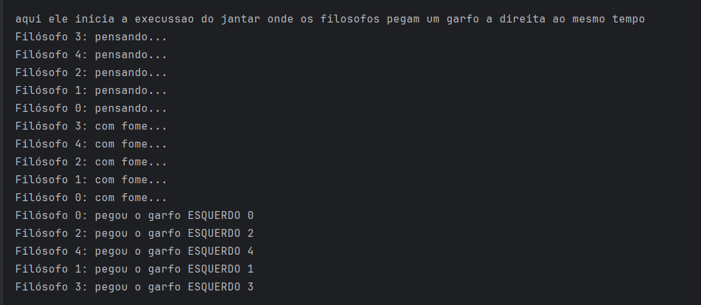
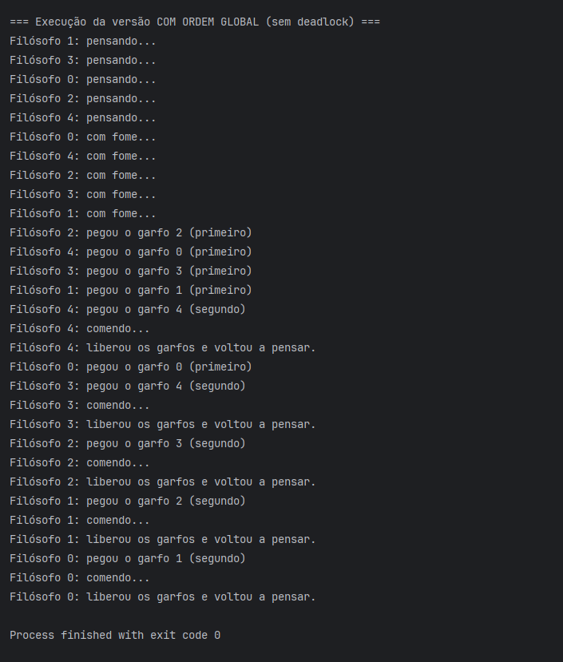

## PUCPR – Performance em Sistemas Ciberfísicos
**Professor:** Andrey Cabral Meira  
**Integrantes:** joao Victor Carvalho de Freitas, Matheus Henrique Heinzen , Vinicius Lima Teider, Edmund Soares De Sousa  
**Ano:** 2025


---
# Jantar dos Filósofos – Impasse e Solução

## Dinâmica do problema

O **Jantar dos Filósofos** modela cinco processos (filósofos) competindo por recursos compartilhados (garfos).  
Cada filósofo alterna entre **pensar**, **ficar com fome** e **comer**.  

Para comer, ele precisa adquirir **dos garfos**, o da esquerda e o da direita — ambos compartilhados com os filósofos vizinhos.

Esse cenário é utilizado para demonstrar problemas clássicos de concorrência, como:

- **Exclusão mútua**  
- **Impasse (deadlock)**  
- **Inanição (starvation)**  
---

## Por que o impasse surge no protocolo ingênuo?

No protocolo ingênuo, cada filósofo tenta:

1. pegar primeiro o **garfo da esquerda**  
2. depois pegar o **garfo da direita**

Se todos fizerem isso simultaneamente:

- cada filósofo segura **um garfo**
- todos esperam o segundo garfo, que nunca será liberado
- ninguém progride → **deadlock**

### Log da Espera circular formada:

### Log do jantar com impasse


### Log do jantar ordenado sem espera circular


## Relação com as Condições de Coffman

O deadlock ocorre porque **todas as quatro condições necessárias** estão presentes:

### 1. Exclusão mútua  
Cada garfo só pode ser usado por um filósofo por vez.

### 2. Hold and wait  
Cada filósofo segura um garfo e espera o outro.

### 3. Não-preempção  
Um garfo não pode ser tomado à força.

### 4. Espera circular  
Há um ciclo completo de dependências entre os filósofos.

---

## Solução proposta: Hierarquia de recursos

Para evitar o impasse, aplicamos a técnica de **ordenação global dos recursos**.

###  Como funciona:

Cada filósofo:

- identifica os dois garfos necessários  
- **pega primeiro o garfo de menor índice**  
- depois o garfo de maior índice  

Isso remove a possibilidade de criar um ciclo.

---

##  Condição de Coffman negada

###  **Espera circular**

Ao eliminar a espera circular, **não é mais possível formar um ciclo**, e portanto o deadlock deixa de existir.

---

##  Progresso e justiça

- Todos os filósofos eventualmente conseguem comer.  
- Não ocorre mais uma situação onde todos ficam bloqueados simultaneamente.  
- Não é necessário um árbitro externo — a hierarquia resolve o problema.  

---


## Pseudocódigo do Protocolo Ingênuo (com possibilidade de impasse)

```
Dados:
    N = 5 filósofos numerados de 0 a 4
    Garfos numerados de 0 a N-1

Para cada filósofo p:

    esquerda = p
    direita = (p + 1) mod N

    loop:
        estado[p] <- "pensando"
        pensar()

        estado[p] <- "com fome"

        adquirir(esquerda)     // pode gerar impasse
        adquirir(direita)

        estado[p] <- "comendo"
        comer()

        liberar(direita)
        liberar(esquerda)

        estado[p] <- "pensando"
```

---

## Pseudocódigo Corrigido (hierarquia de recursos)

```
Dados:
    N = 5 filósofos
    Garfos 0..N-1 (garfo i entre filósofo i e (i+1) mod N)

Para cada filósofo p:

    esquerda = garfo_esquerda(p)
    direita  = garfo_direita(p)

    primeiro = min(esquerda, direita)
    segundo  = max(esquerda, direita)

    loop:
        estado[p] <- "pensando"
        pensar()

        estado[p] <- "com fome"

        adquirir(primeiro)   // sempre o menor índice
        adquirir(segundo)    // depois o maior

        estado[p] <- "comendo"
        comer()

        liberar(segundo)
        liberar(primeiro)

        estado[p] <- "pensando"
```

---

# Fluxograma (hierarquia de recurso)

```
[Início]
   ↓
[Filósofo está pensando]
   ↓
[Filósofo fica com fome]
   ↓
[Filósofo tenta pegar garfo ESQUERDO]
   ↓
[Consegue pegar?]
   ↓--------- NÃO ---------←
[Espera pelo garfo ESQUERDO]   |
   ↑                            |
   |----------------------------|
                SIM
                 ↓
      [Filósofo tenta pegar garfo DIREITO]
                 ↓
        [Consegue pegar?]
                 ↓------------ NÃO ------------←
           [Espera pelo garfo DIREITO]         |
                 ↑                              |
                 |-------------------------------|
                            SIM
                             ↓
                    [Filósofo come]
                             ↓
             [Libera garfo DIREITO e ESQUERDO]
                             ↓
                    [Volta a pensar]
                             ↓
                           [Fim]

```

# Fluxograma (hierarquia de recurso)

```
[Início]
   ↓
[Pensar]
   ↓
[Com fome]
   ↓
[Determinar garfo 1 = min(esquerda, direita)]
[Determinar garfo 2 = max(esquerda, direita)]
   ↓
[Pegar garfo 1]
   ↓
[Pegar garfo 2]
   ↓
[Comendo]
   ↓
[Soltar garfo 2]
   ↓
[Soltar garfo 1]
   ↓
[Volta a pensar]
   ↓
[Fim do ciclo]
```
---


